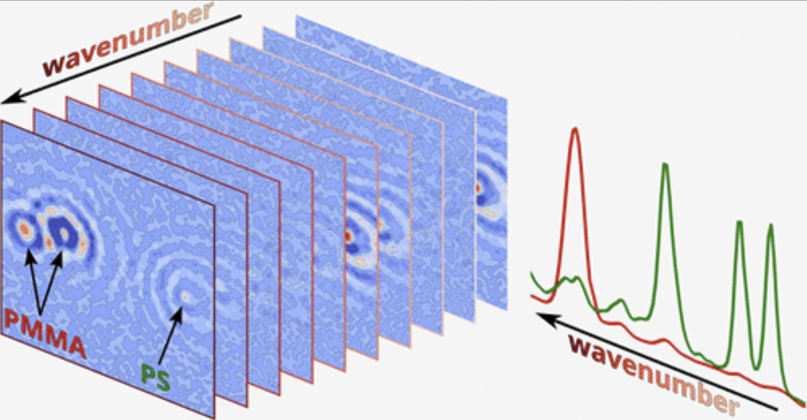
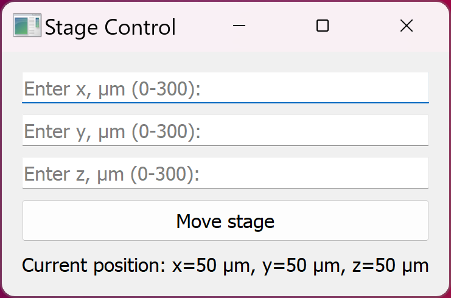
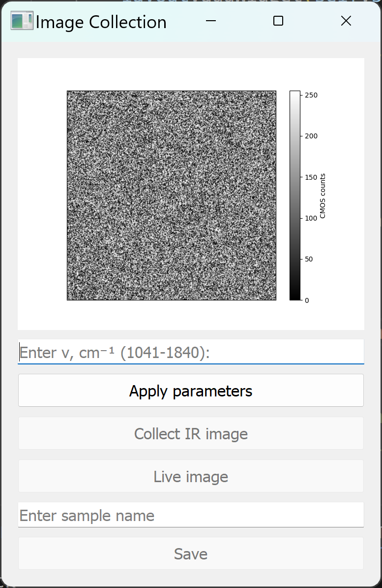
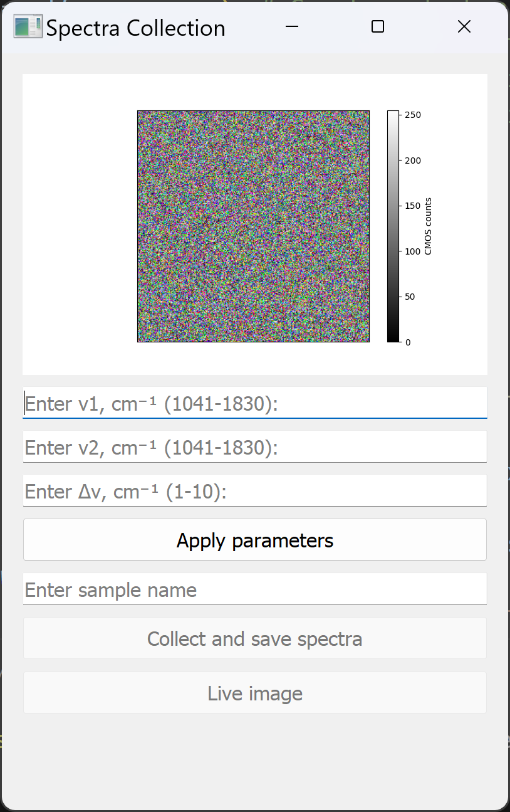
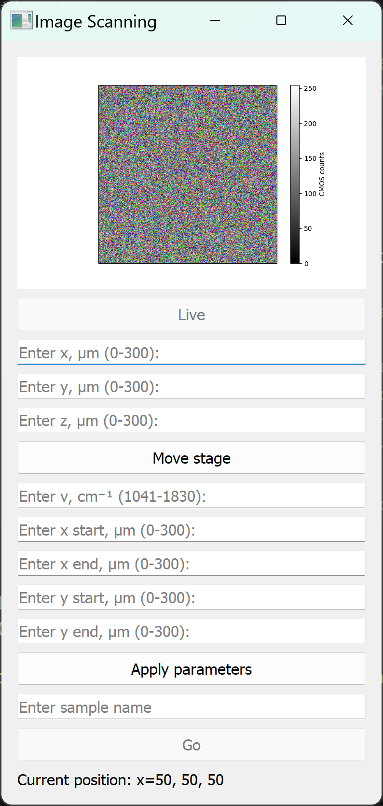
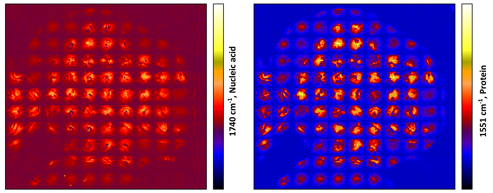

# wIR-PHI GUI

    

This repository presents widefield Infrared Photothermal Heterodyne Imagig (wIR-PHI) Graphocal User Interface (GUI) for wIR-PHI system that operates using the Photron Nova S12 camera. This concept was initially introduced in 2019 by the [Ji-Xin Cheng](https://www.science.org/doi/10.1126/sciadv.aav7127#:~:text=Our%20widefield%20photothermal%20sensing%20microscope%20enabled%20chemical%20imaging%20at%20a) group and later finalized in 2023 by the [Masaru Kuno](https://www.spiedigitallibrary.org/conference-proceedings-of-spie/12392/1239203/Widefield-infrared-photothermal-imaging-and-spectroscopy/10.1117/12.2648082.short#_=_) and [Gregory Hartland](https://pubs.acs.org/doi/abs/10.1021/acsphotonics.3c00559) groups, achieving 20,000 frames per second (fps).

## Requirements

To use this system, ensure that the latest version of the **PVF4 GUI** is installed.

## Configuration Instructions

### Step 1: Configure the Camera

Before running the software, the camera must be properly configured. This can be done by running one of the following scripts:
- **`Apply_Camera_Settings.py`** (runs with a console)
- **`Apply_Camera_Settings.pyw`** (runs without a console)

When the script is executed, the camera settings will automatically be applied. Afterward, the script will open the **PVF4** interface, allowing you to adjust the hardware cropping settings.

### Step 2: Adjust the Stage (X, Y, Z) for Image Positioning

After the camera configuration is complete, leave the **PVF4** software open and run one of the following scripts to adjust the X, Y, and Z positions of the stage:
- **`Image_Positioning.py`** (with a console)
- **`Image_Positioning.pyw`** (without a console)

    

This step is essential for adjusting the image focus and aligning the region of interest for imaging.

### Step 3: Start Image Collection

Once the setup is complete, close the **PVF4** application to free up the camera communication channel. Then, start the **Image Collection** process by running either:
- **`Image_Collection.py`** (with a console)
- **`Image_Collection.pyw`** (without a console)

    

In this application, you will see the real-time visible illumination image from the camera. When the desired wIR-PHI imaging wavelength is selected, click the **Apply** button. This will trigger the laser to adjust to the selected wavelength, and the motor mirror correction will be adjusted accordingly. Once the wavelength is set, the **Collect IR Image** button will become enabled.

Once the **Collect IR Image** button is clicked, the IR image will be displayed in the same window. At this point, the **Apply Parameters** and **Collect** buttons will be disabled, but the **Save** and **Live Imaging** buttons will become available.

- **Saving the Image**: When the **Save** button is clicked, a new folder named **Measurements** will be created outside of the repository. Within this folder, the captured images will be saved in `.txt` format, and the **Save** button will be disabled.
- **Live Imaging**: The **Live Imaging** button allows you to view real-time imaging.

### Step 4: Spectra Collection

    

After finishing image collection, close the **Image Collection** window and open the **Spectra Collection** window.

In this window, enter the scanning wavelength range and the wavelength step, then click **Apply Parameters**. This will trigger the laser and the motor mirror to move to their initial positions.

Next, enter the sample name and click **Collect and Save Spectra** to start the hyperspectral image collection. The data will be saved automatically. For analysis of hyperspectral images, please refer to the [GitHub repository](https://github.com/kirill-kniazev/Hyperspectral-Image-Analysis).

After data collection and saving, click **Live Image** to return to real-time visible light imaging.

## Software Compatibility

This software has been tested with **Python 3.10**.
More details can be foinf in [IR-PHI](https://github.com/kirill-kniazev/IR-PHI/) repo.

---

## Experimental Feature

This section introduces a new experimental feature for the wIR-PHI system: **widefield Mosaic**.

The concept is simple: it combines the ideas of classical scanning IR-PHI and wIR-PHI, where widefield images are collected from different regions of the sample and stitched together to retrieve photothermal information over extremely large areas.

To run this feature, use the **wMosaic** script (`wMosaic.py` or `wMosaic.pyw`).

    

Below is an example of full cheek cells imaged under different light illumination characteristics, highlighting different cell part resonances:

    

Image distortion present due to the Gaussian sample illumination. This is digitally corrected using "x" algorithm.

Results are below  
